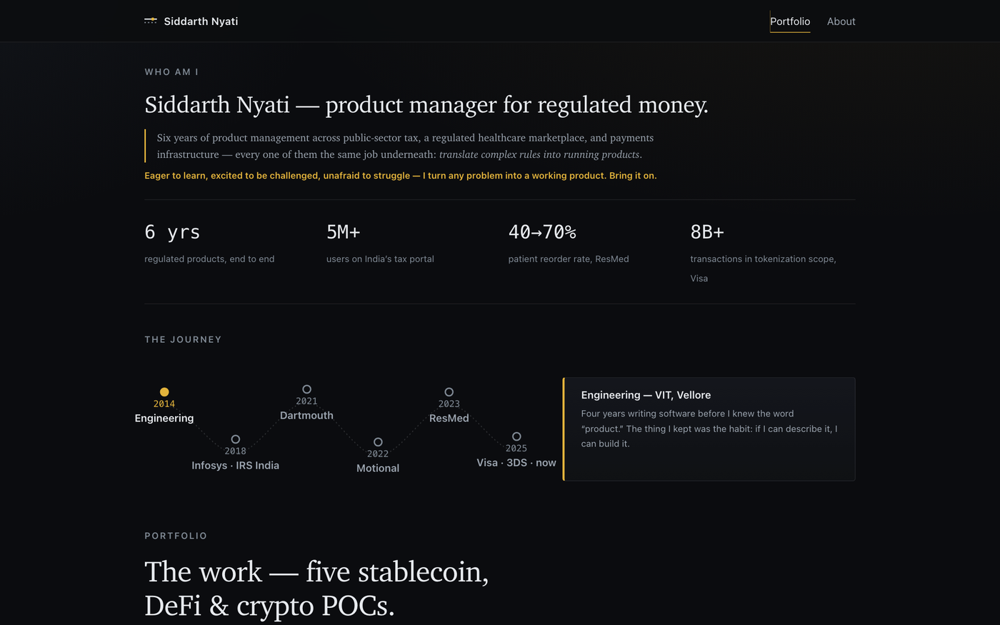
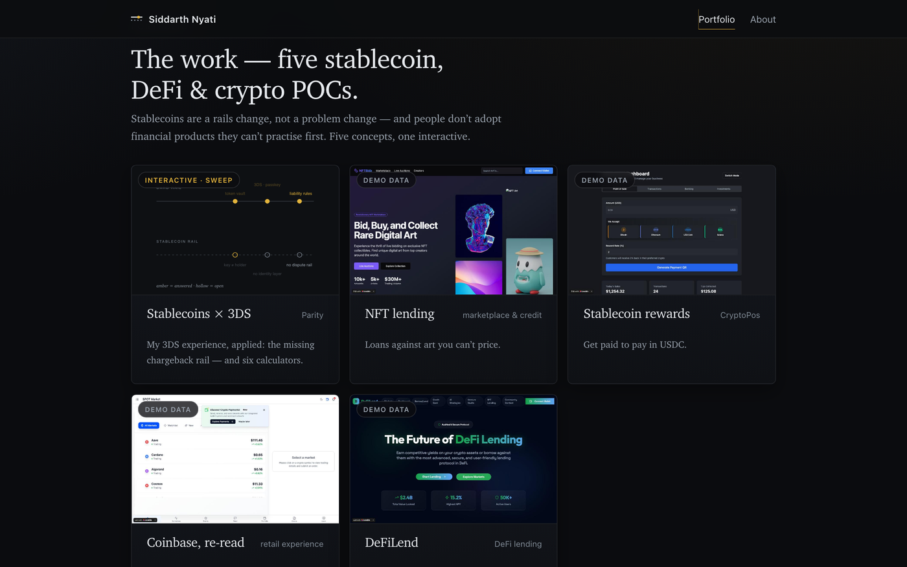
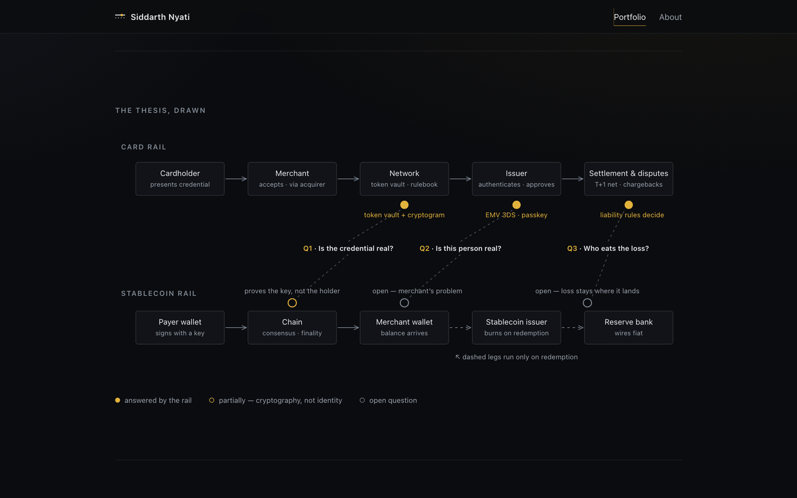
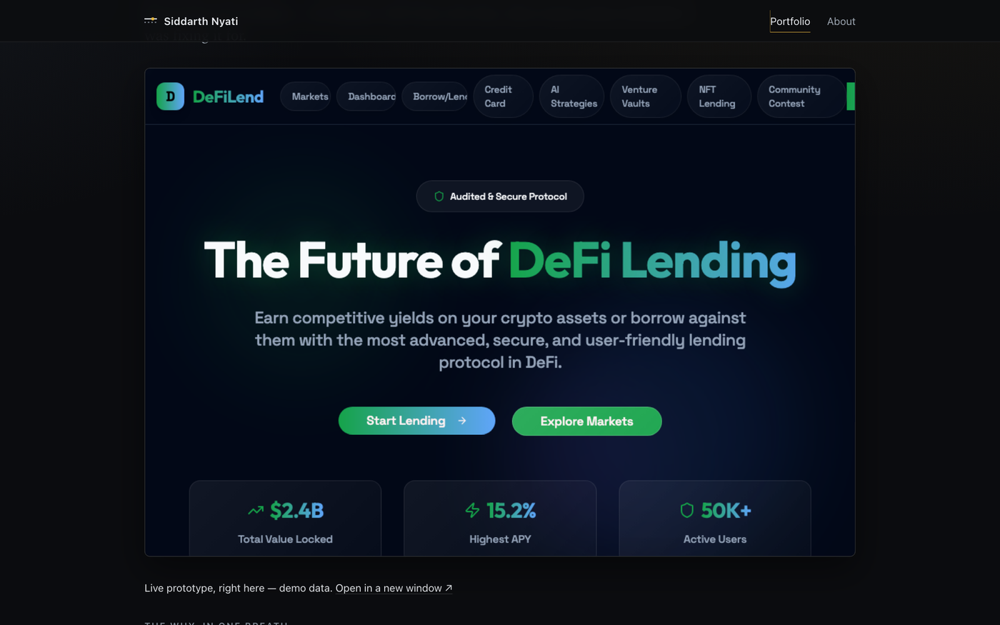

# Stablecoin Lab

**Five stablecoin, DeFi & crypto proofs-of-concept — from a product manager on Visa's 3-D Secure platform.**

### 🔗 **[siddarthnyati.github.io/stablecoin-lab](https://siddarthnyati.github.io/stablecoin-lab/)**

 

*Stablecoins are a rails change, not a problem change. Every payment rail has to answer three questions —*
***is the credential real, is the person real, who eats the loss*** *— and thirty years of card
infrastructure answers them so well that merchants forget they're questions. On stablecoin rails,
that infrastructure doesn't exist yet. These five POCs are about building it.*

---

## The site

**An interactive career timeline that auto-plays the story** — tax rails for 5M+ Indians at Infosys, patient resupply in the ResMed ecosystem, autonomous vehicles at Motional, and now card authentication at Visa:

**Five POCs, one fully interactive** — each tile opens a case study with the problem, the build decisions, a north-star metric, and the live prototype:

**The signature diagram** — the same $100 on card rails vs stablecoin rails. Amber dots are questions the rail answers; hollow dots are the open problems the POCs attack:

**Live prototypes embedded in-page** — DeFiLend runs right inside its case study:

## The five POCs

| POC | One breath | Case study |
|---|---|---|
| **Parity** — Stablecoins × 3DS | Chargebacks are the feature crypto forgot to copy. Three dispute mechanisms, priced — plus six interactive calculators for settlement, reserves, mint/burn, custody, and treasury. | [Open →](https://siddarthnyati.github.io/stablecoin-lab/work/stablecoin-settle/) |
| **DeFiLend** — Aave, reimagined | Borrowing isn't broken — it's biased. Five behaviour patterns that scare newcomers off DeFi, each closed with a feature. Live prototype embedded. | [Open →](https://siddarthnyati.github.io/stablecoin-lab/work/defilend/) |
| **NFT lending** — marketplace & credit | Loans against art you can't price: mark by realised sales, size by exit speed, plan the liquidation before the loan. | [Open →](https://siddarthnyati.github.io/stablecoin-lab/work/nft-lending/) |
| **CryptoPos** — stablecoin rewards | Get paid to pay in USDC — merchant-funded rewards with the economics visible at the counter, not at month-end. | [Open →](https://siddarthnyati.github.io/stablecoin-lab/work/cryptopos/) |
| **Coinbase, re-read** — retail experience | The product line is complete; the experience isn't. Paths for the newcomer: discover → understand → practise → fund. | [Open →](https://siddarthnyati.github.io/stablecoin-lab/work/coinbase/) |

Also on the site: [why card rails transfer](https://siddarthnyati.github.io/stablecoin-lab/from-card-rails/) ·
[how I run programs](https://siddarthnyati.github.io/stablecoin-lab/how-i-run-programs/) (discovery → POC → validation → scale/no-scale) ·
[about](https://siddarthnyati.github.io/stablecoin-lab/about/)

## How it's built

- **Zero build step.** Hand-written HTML, one shared stylesheet, vanilla JS — nothing to rot. Deploys straight to GitHub Pages.
- **Every diagram is inline SVG**; the interactive pieces (cursor-sweep rails, the six-surface calculator deck, the auto-playing timeline) are small dependency-free scripts.
- **Prototypes** were built in Lovable; screenshots are captured with headless Chrome, and published prototypes embed live in their case pages.
- All prototype figures are illustrative demo data — nothing here shipped, had users, or was commissioned.

## Contact

**Siddarth Nyati** · [sidd.nyati96@gmail.com](mailto:sidd.nyati96@gmail.com) · [LinkedIn](https://www.linkedin.com/in/siddarth-nyati/)

Dev: any static server from the repo root works, e.g. `python3 -m http.server`.
